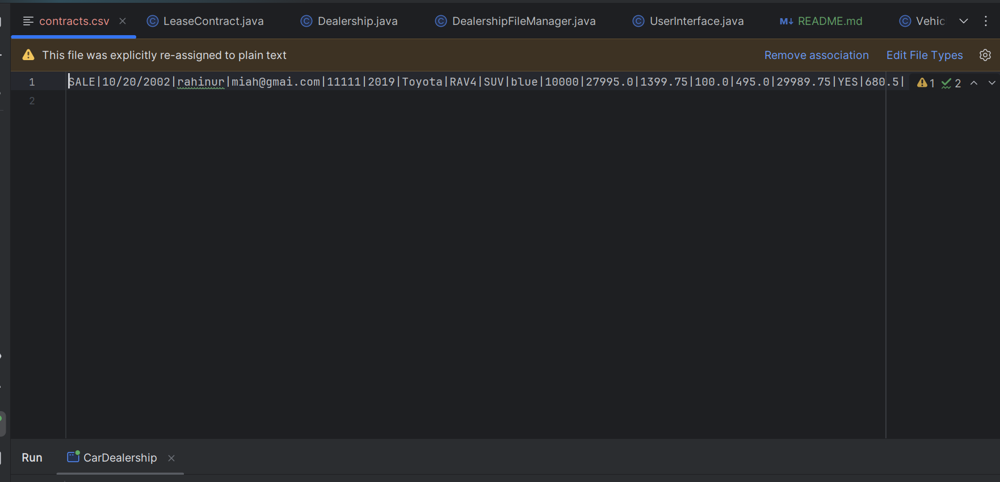
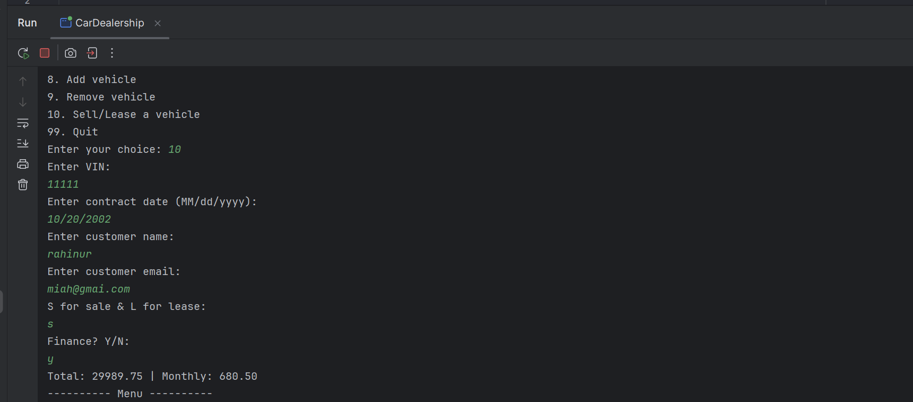

# Project Title

Car Dealership Console Application

## Description of the Project

Car dealership console application is designed for dealerships to filter cars through various different searches, list,
add and remove vehicles. It reads from a file and overwrites the csv file with new vehicle information.
## User Stories

- As a user, I want to be able to make a purchase so that I can get a contract of the car I want to sell.
- As a user, I want to lease cars so that I can choose to lease cars based on my preference.
- As a user, I want to only look at available cars so that I don't waste my time looking up vehicle that aren't in the inventory.
- As a user, I want to be able to make a purchase without calculating the price so that I don't have to waste my time.

## Setup

After you have opened the folder with the instructions listed on "Running the application in intellij, scroll downed to
"Program" class to run the application.

### Prerequisites

- IntelliJ IDEA: Ensure you have IntelliJ IDEA installed, which you can download from [here](https://www.jetbrains.com/idea/download/).
- Java SDK: Make sure Java SDK is installed and configured in IntelliJ.

### Running the Application in IntelliJ

Follow these steps to get your application running within IntelliJ IDEA:

1. Open IntelliJ IDEA.
2. Select "Open" and navigate to the directory where you cloned or downloaded the project.
3. After the project opens, wait for IntelliJ to index the files and set up the project.
4. Find the main class with the `public static void main(String[] args)` method.
5. Right-click on the file and select 'Run 'YourMainClassName.main()'' to start the application.

## Technologies Used

- Java: JDK 17
- Maven

## Demo

## Future Work

Outline potential future enhancements or functionalities you might consider adding:

- Work on creating admin features
- modifying the app to be more robust and user-friendly.

## Resources

List resources such as tutorials, articles, or documentation that helped you during the project.

- [Youtube](https://www.youtube.com/)
- [W3School](https://www.w3schools.com/java/default.asp)

## Team Members

- Raymond - project management
- Rahinur Miah - Developer

## Thanks

Express gratitude towards those who provided help, guidance, or resources:

- Thank you to Raymond for continuous support and guidance!
